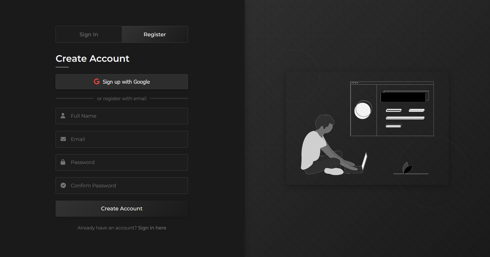

# EduConnect Hub

## Description
EduConnect Hub is a user-friendly communication platform designed for academic departments that helps students connect with faculty, get answers to questions, and collaborate on projects - all in one place.

The platform solves three key challenges:
1. **Finding Help**: Get quick answers to academic and administrative questions
2. **Project Collaboration**: Find partners and mentors for your projects
3. **Communication**: One central place for all department communication

## Features
- **Problem Solving**: Post questions and get matched with experts
- **Project Collaboration**: Share ideas and find teammates
- **Simple Interface**: Easy-to-use design for all users
- **Secure Access**: Protected login system

## How to Use

### For Students
1. Create an account with your academic email
2. Post your question or project idea
3. Get matched with the right expert or collaborator
4. Track status and receive notifications

### For Faculty/Staff
1. Login with your department credentials
2. View questions in your area of expertise
3. Respond to student queries
4. Mentor project teams

## Installation

### Setup Frontend
```bash
# Clone the repository
git clone https://github.com/yourusername/educonnect-hub.git

# Install frontend dependencies
cd educonnect-hub/client
npm install

# Start frontend
npm start
```

### Setup Backend
```bash
# Install backend dependencies
cd ../server
npm install

# Start the server
node server.js
```

### Requirements
- Node.js v14+
- MongoDB
- Modern web browser

## Technologies
- React
- Node.js
- Express
- MongoDB
- Tailwind CSS


---

Made with ❤️ to improve academic communication
