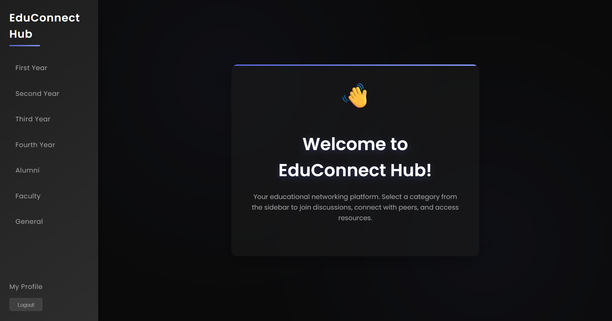

# EduConnect Hub

     

EduConnect Hub is a user-friendly communication platform designed for academic departments that helps students connect with faculty, get answers to questions, and collaborate on projects - all in one place.

The platform solves three key challenges:
1.  **Finding Help**: Get quick answers to academic and administrative questions.
2.  **Project Collaboration**: Find partners and mentors for your projects.
3.  **Communication**: One central place for all department communication.



## Features

-   **Problem Solving**: Post questions and get matched with experts.
-   **Project Collaboration**: Share ideas and find teammates.
-   **Simple Interface**: Easy-to-use design for all users.
-   **Secure Access**: Protected login system with role-based access for students and faculty.
-   **Real-time Chat**: Instant messaging for seamless communication.

## Technologies Used

-   **Frontend**: React, Tailwind CSS
-   **Backend**: Node.js, Express.js
-   **Database**: MongoDB
-   **Authentication**: JSON Web Tokens (JWT)

## Getting Started

These instructions will get you a copy of the project up and running on your local machine for development and testing purposes.

### Prerequisites

-   [Node.js](https://nodejs.org/en/) (v14 or newer)
-   [MongoDB](https://www.mongodb.com/try/download/community) (either local or a cloud instance)

### Installation

1.  **Clone the repository:**
    ```sh
    git clone https://github.com/Sutharmanish09/Edu-connect_Hub.git
    cd Edu-connect_Hub
    ```

2.  **Set up the backend:**
    -   Install server dependencies:
        ```sh
        npm install
        ```
    -   Create a `.env` file in the `server` directory. You can copy the example file:
        ```sh
        cp server/.env.example server/.env
        ```
    -   Update the `server/.env` file with your environment variables:
        -   `MONGO_URI`: Your MongoDB connection string.
        -   `JWT_SECRET`: A secret key for signing JWTs.

3.  **Set up the frontend:**
    -   Navigate to the client directory and install dependencies:
        ```sh
        cd client
        npm install
        ```

### Running the Application

1.  **Start the backend server:**
    -   From the **root** project directory, run:
        ```sh
        npm start
        ```
    -   The server will start on `http://localhost:5000` (or the port specified in your environment).

2.  **Start the frontend client:**
    -   In a new terminal, navigate to the **client** directory and run:
        ```sh
        npm start
        ```
    -   The application will open in your browser at `http://localhost:3000`.

## Contributing

Contributions are what make the open source community such an amazing place to learn, inspire, and create. Any contributions you make are **greatly appreciated**.

If you have a suggestion that would make this better, please fork the repo and create a pull request. You can also simply open an issue with the tag "enhancement".

1.  Fork the Project
2.  Create your Feature Branch (`git checkout -b feature/AmazingFeature`)
3.  Commit your Changes (`git commit -m 'Add some AmazingFeature'`)
4.  Push to the Branch (`git push origin feature/AmazingFeature`)
5.  Open a Pull Request

## License

Distributed under the MIT License. See `LICENSE` for more information.

---

Made with ❤️ to improve academic communication.